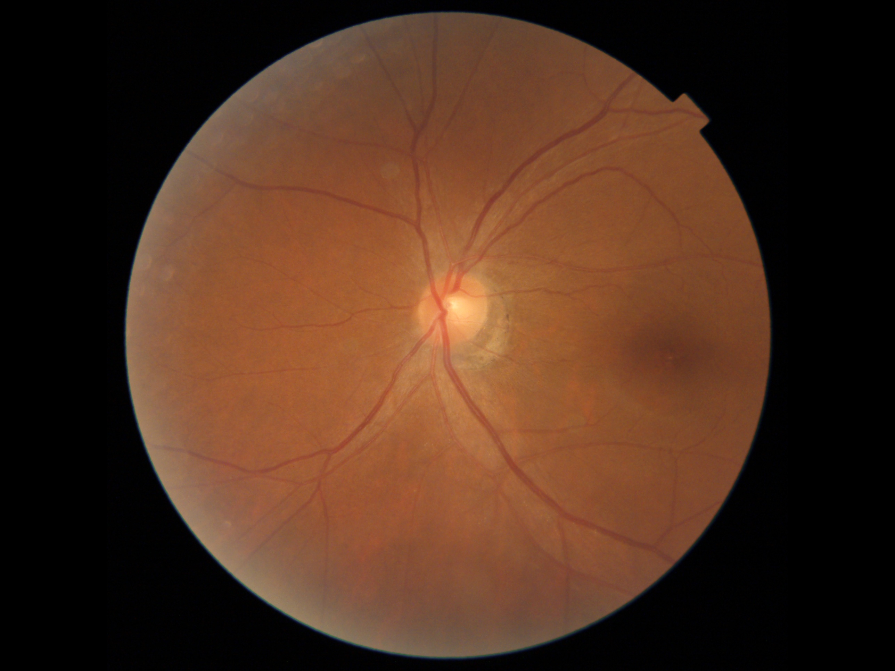
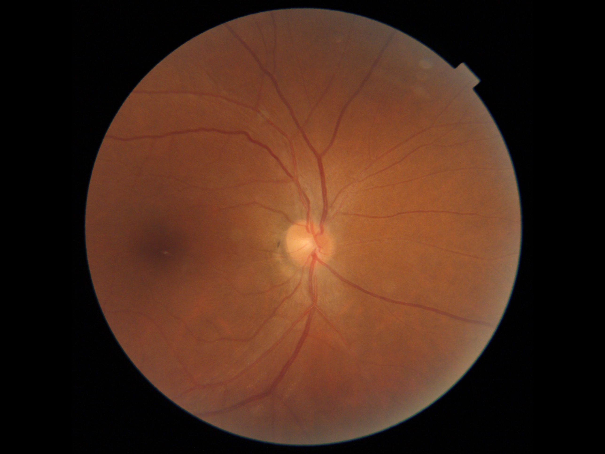

# RetiBrain Fusion Training

This repository provides a clean training pipeline for fusing bilateral color fundus photographs (CFP), retinal morphology features, and clinical metadata for continuous brain biomarker regression.

The refactored code is organized for reproducibility and readability rather than as a single experiment notebook/script.

## Repository structure

```text
RetiBrain/
├── configs/
│   └── example_kailuan_fusion.yaml   # editable experiment configuration
├── retibrain_fusion/
│   ├── config.py                     # YAML config parsing and metadata-part selection
│   ├── datasets.py                   # CFP + morphology + metadata dataset
│   ├── models.py                     # CFP, morphology, metadata and fusion models
│   ├── engine.py                     # train/evaluate loops
│   ├── checkpoints.py                # checkpoint loading/saving helpers
│   ├── metrics.py                    # regression metrics
│   ├── plotting.py                   # scatter and Bland-Altman diagnostics
│   └── utils.py                      # seed, logger, device, early stopping
├── scripts/
│   └── train_fusion.py               # main training entry
├── train.py                          # short wrapper entry
├── requirements.txt
└── pyproject.toml
```

## Data Demo (retibrain/Data_demo)

To make the dataset more interpretable and reproducible, we provide a visualized example sample.

### Sample ID = 5

**Brain biomarker values (from CSV):**

| ID | WMH | WMH_log1p |
|----|-----|----------|
| 5  | 8.07 | 2.204972 |

### Bilateral fundus images

[//]: # (Left eye &#40;CFP&#41;:)

[//]: # (![Left Eye]&#40;Data_demo/ID5_L.jpg&#41;)

[//]: # ()
[//]: # (Right eye &#40;CFP&#41;:)

[//]: # (![Right Eye]&#40;Data_demo/ID5_R.jpg&#41;)

<table>
  <tr>
    <td align="center">
      <b>Left eye</b><br>
      
    </td>
    <td align="center">
      <b>Right eye</b><br>
      
    </td>
  </tr>
</table>

---

### Notes
- Images correspond to paired CFP inputs used for modeling.
- WMH represents white matter hyperintensity burden derived from MRI.
- WMH_log1p is the transformed regression target used during training.

## Quick start

```bash
pip install -r requirements.txt
python train.py --config configs/example_kailuan_fusion.yaml
```

You can also override the output directory or device:

```bash
python train.py --config configs/example_kailuan_fusion.yaml \
  --output-dir ./outputs/debug \
  --device cuda:0
```

## Expected CSV columns

The dataset expects one row per subject/sample and requires:

- CFP path columns:
  - `OP_L`, `OP_R`
- morphology feature columns with matching left/right prefixes:
  - `OP_L_optic_disc_*`, `OP_R_optic_disc_*`
- target column, for example `WMH_log1p`
- metadata columns listed in `data.metainfo_map`

DICOM (`.dcm`/`.dicom`) and common image formats are supported.

## Notes on preprocessing

Metadata normalization is fitted on the training split and reused for validation. This avoids validation-set distribution leakage and makes fold-level evaluation easier to reproduce.

If the target is stored as `log1p(value)`, keep `label_transform: log1p` so validation metrics and diagnostic plots are reported on the original scale.

## Checkpoint reuse

Pretrained CFP and metadata checkpoints are optional. Configure them in the `pretrained` section of the YAML file. The loader only imports parameters whose names and shapes match the current model, which allows new regression/fusion heads to remain randomly initialized.

## Outputs

For each fold, the training script saves:

- `train.csv` and `val.csv`
- `epoch_metrics.csv`
- validation prediction CSVs for the best checkpoints
- optional SVG diagnostic plots under `vis/`